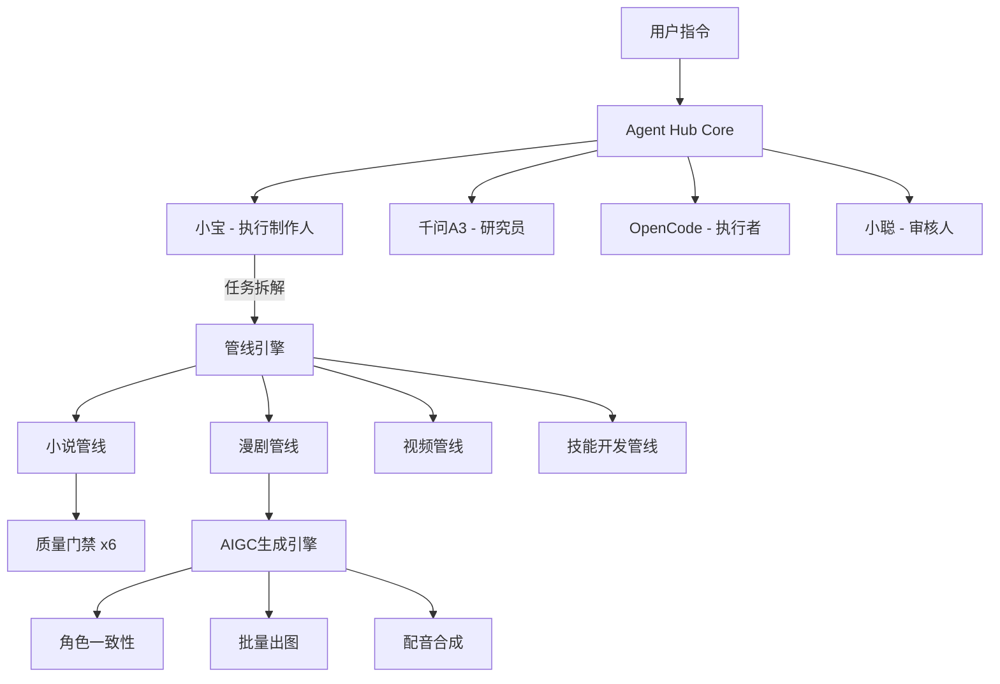

# Agent Hub 🦞

> **多 Agent 协作管理系统 + AIGC 创作管线** — 让 AI Agent 集群像真实团队一样工作

<p align="center">
  
  
  
  
</p>

## 🎯 定位

Agent Hub 是一个**多异构 Agent 协作平台**，连接小宝、千问A3、OpenCode、小聪等 Agent，通过管线化的任务分发与质量门禁，实现从小说创作到 AIGC 漫剧生产的全流程自动化。



## ✨ 核心能力

| 模块 | 说明 |
|------|------|
| 🧠 **Agent 编排** | 消息路由 + 状态追踪 + 任务分发（MQ + WebSocket） |
| 📋 **管线系统** | YAML 定义多阶段管线，每阶段质量门禁 + 审批点 |
| 🤖 **专家库** | 215+ 即插即用 AI 专家角色（engineering / marketing / design 等 18 部门） |
| 🎨 **AIGC 工作流** | 小说 → 剧本 → 分镜 → 批量出图 → 配音 → 合成视频 |
| 📊 **管理面板** | React + Vite + Tailwind 构建的实时 Agent 状态看板 |
| 🔐 **质量门禁** | 6 道小说门禁 + 漫剧故事板门禁（规划中） |

## 🏗 项目结构

```
agent-hub/
├── AGENT_HUB_GUIDE.md     ← Agent 操作契约（核心文档）
├── ROADMAP.md             ← v2 升级规划
├── agency-agents/         ← 215 个 AI 专家角色（中文社区版）
│   ├── engineering/       ← 工程师角色（前端/后端/SRE/安全等）
│   ├── marketing/         ← 营销角色（抖音/小红书/B站/SEO等）
│   ├── design/            ← 设计角色（UI/UX/品牌等）
│   └── ...                ← + 18 个部门
├── workflows/             ← AIGC 创作工作流
│   ├── aigc-comic/        ← 漫剧故事板全流程 + Toonflow 素材库
│   └── aigc-image-tool/   ← AIGC 图像工具管线 + 提示词引擎
├── smart-skill-manager/   ← 智能 Skill 分类分级管理器
├── scripts/               ← 运维脚本（启动/注册/心跳/部署）
├── src/                   ← 管理面板前端（React + Vite + Tailwind）
├── design/                ← 架构设计方案（自动注册/会议室/工作室）
├── genre-skills/          ← 小说题材技能（仙侠/都市等）
├── gatekeeper.js          ← 质量门禁（6 道校验）
└── novel-*.md             ← 小说创作管线技能
```

## 🚀 快速开始

```bash
# 克隆
git clone https://github.com/xinxin5268/agent-hub.git
cd agent-hub

# 安装依赖
npm install

# 启动 Agent Hub 核心服务
bash scripts/start.sh

# 注册 Agent
bash scripts/register-agent.sh

# 查看管理面板
# 访问 http://localhost:5173
```

## 🧠 Agent 集群

| Agent | ID | 能力 | 通信方式 |
|-------|-----|------|----------|
| 小宝 | xiaobao | 编排、写作、决策 | WebSocket |
| 千问A3 | qianwen-a3 | 研究、拆书、题材分析 | ACP |
| OpenCode | opencode-wsl | 代码编写、文件生成 | MQ |
| 小聪 | xiaocong-win | 审核、门禁校验 | WebSocket |

## 🎨 AIGC 漫剧管线

从小说到漫剧的六步工作流：

```
剧本分析 → 分镜拆解 → 提示词工程 → 批量生成 → 筛选排序 → 后期合成
```

详细内容见 [`workflows/aigc-comic/`](./agent-hub/workflows/aigc-comic/)

## 📜 License

MIT
